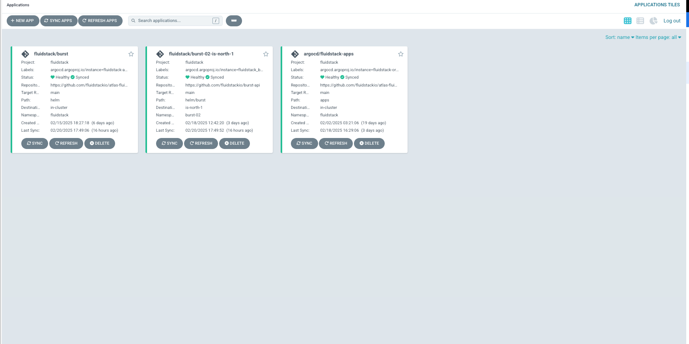
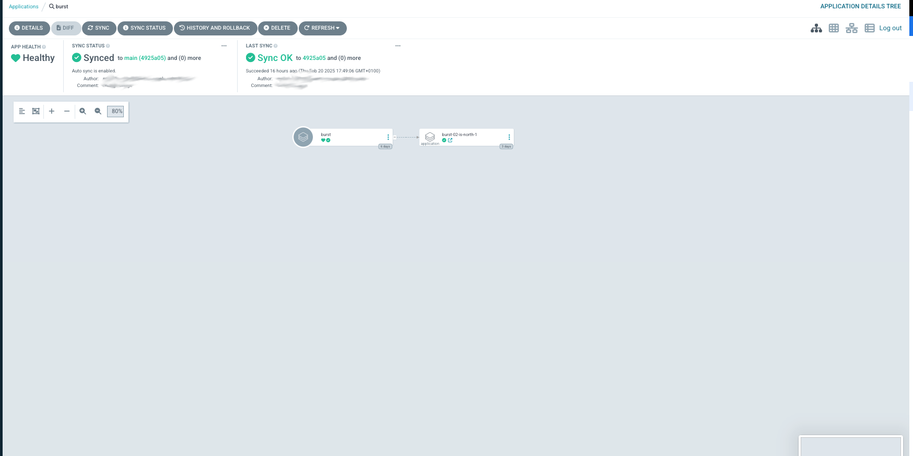
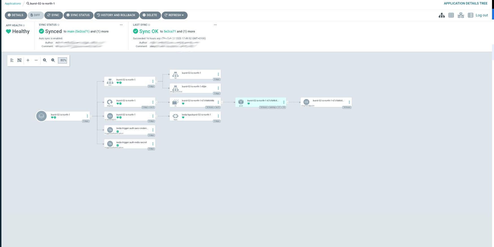
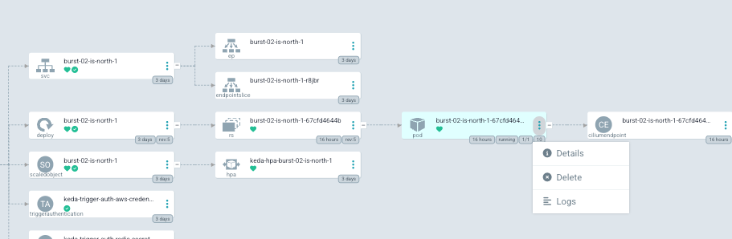
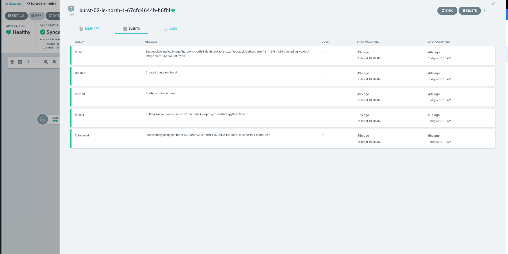
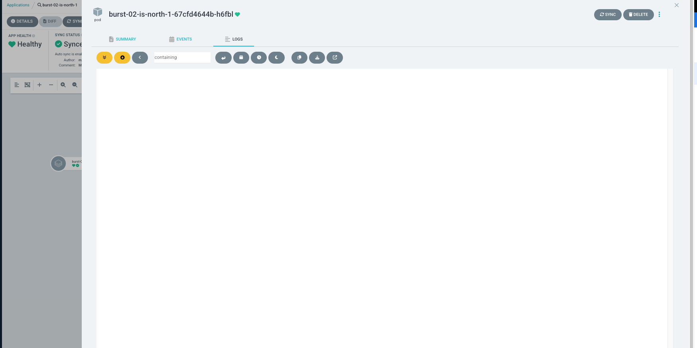

# ArgoCD

We have set up so that your have view-only permissions to their [Argo CD](https://argo.fluidstack.io) projects. In your setup, there is a main application for each project and multiple sub-applications (sub-apps). Each sub-app represents your deployment in a specific cluster. The image below shows the all the applications (and sub apps) as UI tiles in a project. 
 

This guide helps you monitor your deployment with a focus on:
- Viewing sync progress for your sub-apps
- Viewing deployments and pods
- Viewing pod events and logs

Below is a brief walkthrough on how you can use Argo CD’s interface to track the status of your deployments and resources across multiple clusters.

1. **Accessing Argo CD**
   - Navigate to the Argo CD dashboard (your admin or support team can provide a link).
   - Log in with your provided credentials. You have view-only permissions, so you won’t accidentally change anything.

2. **Finding Your Main App and Sub-Apps**
   - Once logged in, you’ll see a list of “Applications.” Look for the one matching your project name; this is your “Main App.”
   - Click on your Main App. It expands to show multiple “Sub-Apps,” each corresponding to your deployment in a specific cluster (e.g., is-north-1, ca-east-1, etc.).
   

   

3. **Viewing Sync Progress**
   - Select a Sub-App to see its current status. Argo CD displays whether the application is:
     - “Synced” (the live environment matches the desired state).
     - “OutOfSync” (there are changes not yet applied to the cluster).
   - Keep an eye on in-progress sync operations, any reported errors, and any warnings highlighted in red or orange.
   

   

4. **Reviewing Deployments and Pods**
   - Click through the Sub-App’s “tree” or “list” view to see Kubernetes resources (Deployments, ReplicaSets, Pods, etc.).
   - Hover over each resource for quick info or click on it for detailed resource metadata and annotations (helpful for debugging).

   

5. **Viewing Pod Events**
   - In the detailed resource panel (after clicking a Pod or other resource), switch to the “Events” tab.
   - Here, you’ll find timestamps and progress messages about your Pod (e.g., image pulls, start-up statuses, restarts).
   - Monitoring events helps you detect issues like image pull errors or insufficient resource allocations.
   

   

6. **Checking Pod/Container Logs**
   - For deeper troubleshooting or to observe your app’s runtime behavior, click the “Logs” button in the resource panel of a Pod.
   - Argo CD provides a read-only log viewer, which you can scroll and search for specific errors or warnings.

   

7. **Tips for Success**
   - If your Sub-App is “OutOfSync,” it may be reconciling new configurations. Watch the “History” tab to track live progress.
   - Events and logs are your first line of defense against common deployment issues.
   - For recurring failures or unclear error messages, contact support with logs or screenshots for quicker assistance.

