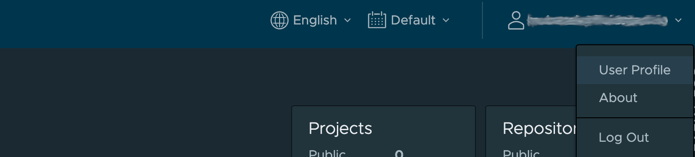
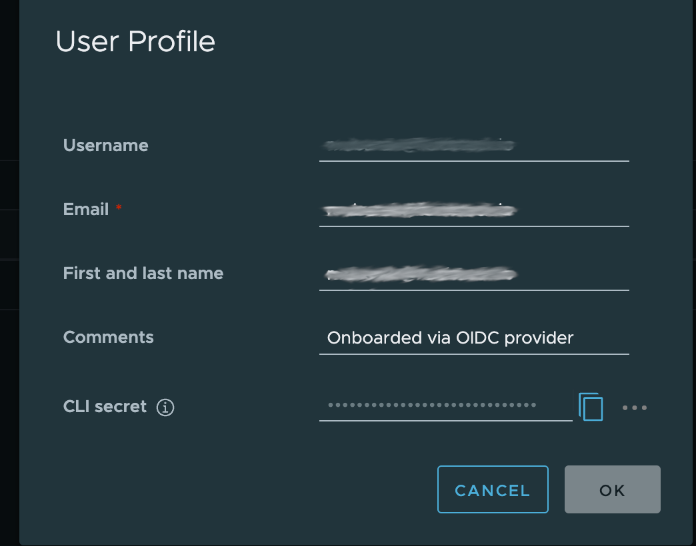

# Container Registry

## Getting Started

To establish your organization's presence on Harbor, start by visiting the [Harbor Portal](https://harbor.fluidstack.io). Use your official organization email during registration - this automatically creates a dedicated namespace following the pattern `harbor.fluidstack.io/<org_directory>`. For example, if your company is "Acme Corp", your namespace becomes `harbor.fluidstack.io/acme-corp`. After completing email verification, you'll gain access to your organization's private registry space.

In your Harbor dashboard, locate the profile icon in the top-right corner.



Clicking this reveals the "CLI Access" option where you'll generate your unique access token. Treat this token like a password - it's your key to pushing and pulling images through Docker CLI.



You can revoke and regenerate this token through the same interface.

## Configuring Docker Access

With your credentials ready, open your terminal and authenticate using:

```bash
docker login harbor.fluidstack.io
```
When prompted, enter your registered email as the username and paste your CLI secret as the password. A `Login Succeeded` message should be displayed on successful login. If you encounter authentication issues, run `docker logout harbor.fluidstack.io` to clear cached credentials and repeat the login process.

## Building and Deploying Images

When preparing your Docker images, use this naming convention for consistency:
```bash
harbor.fluidstack.io/<org_directory>/<image_name>:<tag>
```
For development builds, you might use the `latest` tag, while production deployments should use semantic versioning like `v1.2.3`. After building your image with `docker build`, push it to the registry using `docker push`. For advanced users needing multi-architecture support, consider using Docker Buildx to push images compatible with both AMD64 and ARM64 systems in a single command.


## Troubleshooting

### Authentication 

If you receive authentication errors, first verify your credentials using `cat ~/.docker/config.json | grep "harbor.fluidstack.io"`. Access denial messages typically indicate a namespace mismatch - double-check your organization directory spelling. For persistent authentication failures, regenerate your CLI secret via the Fluidstack Harbor dashboard. If already authenticated through the web interface, first log out and back in before generating a new CLI secret.


### Pushing images 

The FluidStack harbor registry is configured to handle large image uploads, however if you encounter issues when pushing images, 

1. Consider ensuring that your docker image does not contain single a layer 100GB in size or more
2. Reuse image names and use semantic versioning like `v1.2.3` for image tags. This ensures that layers are cached in the registry and pushing subsequent builds is faster. 
3. Consider using [common tips](https://devopscube.com/reduce-docker-image-size/) to keep your docker images small and uploads faster. 
4. If you have especially large files (models, data) included in the image that increase the image size, Surge supports a shared storage between containers that can serve as a local cache for your application code. 


