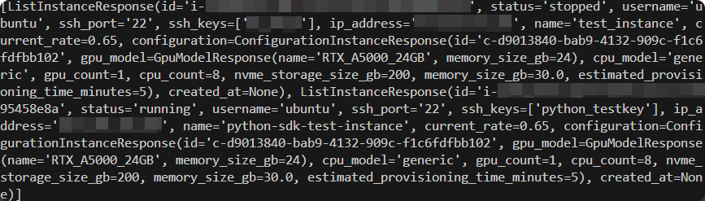
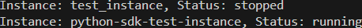

## Prerequisites
- An [API key](/dashboard/api-keys)
- Familiarity with command-line tools
- Basic familiarity with Python; Python 3+ installed

## Install the SDK

Our Python SDK is hosted at the [Python Package Index](https://pypi.org/project/fluidstack/) (PyPI). You can use any Python package manager, such as [pip](https://pip.pypa.io/en/stable/) or [poetry](https://python-poetry.org/docs/). 

For example, you can add this dependency to your project's build file:
```python
pip install fluidstack
# or
poetry add fluidstack
```

## Instantiate a client

Import `FluidStack` and instantiate a client with your API key:

```python Example
from FluidStack.client import FluidStack

client = FluidStack(
    api_key = "<your_api_key>"
)
```

Now you can use the client to consume the API from your Python application.

## Secure use of your API key

For security, keep your API key outside of any file that could potentially be seen by others, now or in the future. 

There are many ways to secure the use of your API key. One common approach is using an `.env` file. Create a file named `.env` or look for one that already exists in your project. Add your key to it, then use the `dotenv` module to import it into your Python file. 

Example:

```properties .env file
FLUIDSTACK_API_KEY="api_key_j123YourAPIKey"
```
```python Python file
from FluidStack.client import FluidStack
from dotenv import load_dotenv
import os

load_dotenv() # loads the variables from your .env file

client = FluidStack(
  api_key = os.getenv('FLUIDSTACK_API_KEY')
)
```
<Warning>
  If your `.env` file is inside a git repository, make sure that it's added to the [`.gitignore`](https://git-scm.com/docs/gitignore) file for that repository.
</Warning>

## Use the FluidStack client in your app

The FluidStack client simplifies making API requests. It stores the API key that you used to instantiate it, and it already knows our API server's base URL, so you can omit those details in your requests.

The SDK also provides code hints, type hints, parameter information, and other useful functions to speed up development. 

For example, compare the tabs below:

<CodeBlocks>
```python With the SDK
client.instances.create(
  name="my_instance",
  gpu_type="RTX_A6000_48GB",
  ssh_key="my_ssh_key"
)
```
```python Without the SDK
requests.post(
  api_url + "instances",
  headers = headers,
  json = {
      "name": "my_instance",
      "gpu_type":"RTX_A6000_48GB",
      "ssh_key": "my_ssh_key"
  }
)
```
</CodeBlocks>

You can see that instead of using `requests` or a similar module to send an HTTP request and including the endpoint path and headers each time, the FluidStack client simplifies the request for you. 

## Call endpoints

Requests to API endpoints are implemented in the SDK as methods of the client. For example, the [GET /instances](/api-reference/instances/list) endpoint is implemented like this:

```python List user instances with the SDK
client.instances.list()
```

The code shown above does not do anything with the response from the endpoint. It is up to you to handle the response.

For example, you could simply print the entire response to the terminal:

```python Print the entire response
print(client.instances.list())
```
Example output:


Or you could loop through the list and print only the name and status for each instance:
```python Print each instance name and status
my_instances = client.instances.list()
for instance in my_instances:
    print(f"Instance: {instance.name}, Status: {instance.status}")
```

Example output:


## Instances 

<Tabs>
  <Tab title="List user instances">
    ```python 
      client.instances.list()
    ```
    **Parameters: None.**
  </Tab>

  <Tab title="Create an instance">
    ```python 
    client.instances.create(
      name="my_instance",
      gpu_type="my_gpu_type",
      ssh_key="my_ssh_key",
      gpu_count="my_gpu_count"
      operating_system_label="my_os_label"
    )
    ```
    | parameter              | type   | required | default                 |
    |------------------------|--------|----------|-------------------------|
    | name                   | string |     y    |   n/a                   |
    | gpu_type               | string |     y    |   n/a                   |
    | ssh_key                | string |     y    |   n/a                   |
    | gpu_count              | string |     n    |    1                    |
    | operating_system_label | string |     n    | ubuntu_20_04_lts_nvidia |

  </Tab>

  <Tab title="Stop an instance">
    ```python 
    client.instances.stop(
        instance_id="instance_id",
    )
    ```
    | parameter              | type   | required |
    |------------------------|--------|----------|
    | instance_id            | string |     y    |
  </Tab>
  
  <Tab title="Start an instance">
    ```python
    client.instances.start(
        instance_id="instance_id",
    )
    ```
    | parameter              | type   | required |
    |------------------------|--------|----------|
    | instance_id            | string |     y    |
  </Tab>

  <Tab title="Terminate an instance">
    ```python 
    client.instances.delete(
        instance_id="instance_id",
    )
    ```
    | parameter              | type   | required |
    |------------------------|--------|----------|
    | instance_id            | string |     y    |
  </Tab>
</Tabs>

## SSH Keys

<Tabs>
  <Tab title="List SSH keys">
    ```python 
      client.ssh_keys.list()
    ```
    **Parameters: None.**
  </Tab>

  <Tab>
    ```python Add an SSH key
    client.ssh_keys.create(
      name="my_ssh_key", 
      public_key="my_public_key" 
    )
    ```
    | parameter              | type   | required |
    |------------------------|--------|----------|
    | name                   | string |     y    |
    | public_key             | string |     y    |
  </Tab>

  <Tab title="Delete an SSH key">
    ```python 
    client.ssh_keys.delete(
        ssh_key_name="my_ssh_key",
    )
    ```
    | parameter              | type   | required |
    |------------------------|--------|----------|
    | ssh_key_name           | string |     y    |
  </Tab>
</Tabs>


## List available configurations and operating system templates

<Tabs>
  <Tab title="Configurations">
    ```python 
    client.configurations.list()
    ```
    **Parameters: None.**
  </Tab>

  <Tab title="OS Templates">
  ```python 
  client.templates.list()
  ```
    **Parameters: None.**
  </Tab>
</Tabs>